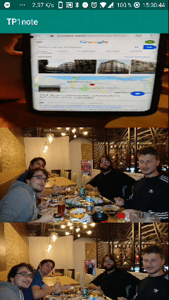

# TP1noté - 8INF865
L'objectif de ce TP est de concevoir une application qui récupère les photos du téléphone pour les afficher sous la forme d'un quadrillage.  

Ce projet permet les fonctionnalités suivantes :  
  1. **Récupérer les images du téléphone**
  2. **Afficher les images du téléphone dans un quadrillage**
  3. **Permettre de zoomer avec le geste "pinch"**
  4. **Permettre de scroll verticalement avec le geste "scroll"**

### La branche avec le code à jour est la branche **gesture**
  
**Le zoom avec le geste "pinch"** :  
  
**Le scroll vertical avec le geste "scroll"** :  
  
